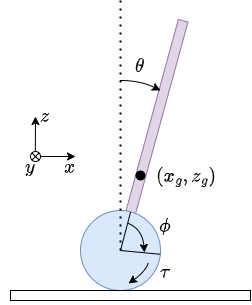

# 車輪型倒立振子の制御プログラム

運動方程式: 

$$
\begin{align*}
    & \begin{bmatrix}
        J_p + J_w + (m_p + m_w) \left(r ^ 2 + l_g ^ 2\right) + 2 m_p r l_g \cos \theta(t) &
        J_w + (m_p + m_w) r ^ 2 + m_p r l_g \cos \theta(t) \\ 
        J_w + (m_p + m_w) r ^ 2 + m_p r l_g \cos \theta(t) & 
        J_w + (m_p + m_w) r ^ 2
    \end{bmatrix} 
    \begin{bmatrix} 
        \ddot{\theta}(t) \\
        \ddot{\phi}(t)
    \end{bmatrix}
    = 
    \begin{bmatrix}
        m_p l_g \left(g + r \dot{\theta}^2(t)\right) \sin \theta(t) \\
        m_p r l_g \dot{\theta} ^ 2 \sin \theta(t)
    \end{bmatrix}
    +
    \begin{bmatrix}
        0 \\
        \tau(t)
    \end{bmatrix}\\
    % 
    & x(t) = r \left(\theta(t) + \phi(t)\right)
\end{align*}
$$

重心位置：

$$
\begin{align*}
    & x_g = l_g \sin \theta + r (\theta + \phi)\\
    & z_g = l_g \cos \theta
\end{align*}
$$

運動エネルギー：

$$
K = \frac{1}{2}\left(J_p \dot{\theta} ^ 2 + m_p \dot{x}_g ^ 2 + m_p \dot{z}_g ^ 2 + m_w r^2\left(\dot{\theta} + \dot{\phi}\right) ^ 2 + J_w \left(\dot{\theta} + \dot{\phi}\right) ^ 2\right)
$$

ポテンシャル：

$$
U = m_p g l_g \cos \theta
$$

| 記号 | 意味 |
| --- | --- |
| $x$ | システムの並進位置 |
| $\theta$ | 倒立角度 |
| $\phi$ | 車輪の絶対角 |
| $m_p$ | 振り子の質量 |
| $m_w$ | 車輪の質量 |
| $l_g$ | 車輪の中心から振り子の重心までの距離 |
| $r$ | 車輪の半径 |
| $J_p$ | 倒立振子の慣性モーメント |
| $J_w$ | 車輪の慣性モーメント |
| $g$ | 重力加速度 |

<!-- for 諸星 ♡ -->
